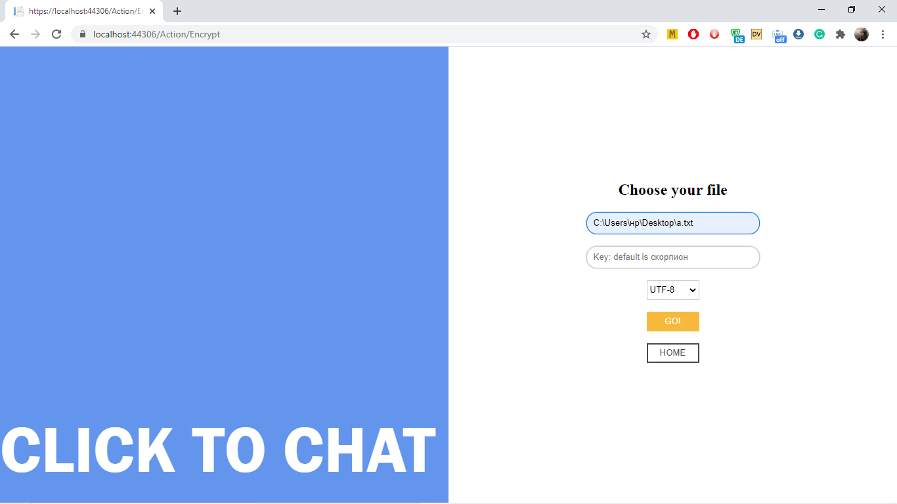
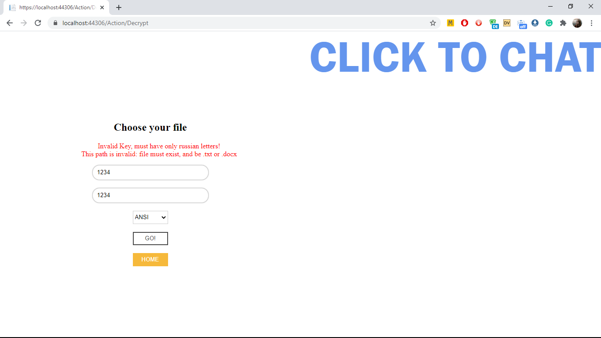

# NYSSCourseProject

<!-- TABLE OF CONTENTS -->

  
Table of Contents

  <ol>
    <li>
      <a href="#about-the-project">About The Project</a>
      <ul>
        <li><a href="#implemented-functionality">Implemented Functionality</a></li>
        <li><a href="#built-with">Built With</a></li>
        <li><a href="#structure">Structure</a></li>
      </ul>
    </li>
    <li><a href="#usage">Usage</a></li>
  </ol>

<!-- ABOUT THE PROJECT -->
## About The Project
ТЗ на работу:

**Минимальный результат:**
1. Создайте программу, в которую можно передать файл с определенной
информацией. Входящий и исходящий формат файла .txt. Известно, что
информация, находящаяся в файле – зашифрована одним из методов простой
замены с ключом. Знаки препинания, и прочие элементы не относящиеся к
алфавиту сообщения не изменяются. В сообщении используется десятичная
система счисления и русский алфавит.
2. Программа должна осуществлять дешифровку информации,
находящейся в файле и вывод её на экран пользователя.
3. Программа должна предоставлять возможность сохранить
дешифрованную информацию в отдельный файл, с указанием его названия и
директории для сохранения.
4. Программа должна обладать интерфейсом для взаимодействия с
пользователем, а также меню для управления функциональными
возможностями программы.
5. Программа должна являться WPF\UWP приложением. 

**Ожидаемый результат:**
В дополнение к минимальному результату:
1. Программа должна предоставлять возможность для зашифровывания
информации, введенной пользователем с клавиатуры, а также возможность
указать ключ.
2. Результат шифрования должен быть сохранен в отдельный файл, с
указанием его названия и директории для сохранения.
3. Основной функционал должен быть покрыт автоматическими Unit
тестами, с использованием стандартных возможностей Unit Testing
Framework. 

**Продвинутый результат:**
В дополнение к ожидаемому результату: 
1. Программа должна предоставлять возможность для считывания
незашифрованной информации из файла, формат файла .docx.
2. Предоставлять возможность для зашифровывания информации в нем,
с возможностью указания ключа.
3. Результат шифрования должен быть сохранен в отдельный файл, с
указанием его названия и директории для сохранения, формат файла .docx.
4. Программа должна быть реализована в виде web-приложения с
использованием стека технологий ASP.NET. 

### Implemented Functionality

Для данного решения были использованы возможности ASP.NET Core MVC:

Возможности программы:
* Шифрование файлов с использованием шифра Виженера.
* Дешифрование файлов с использованием шифра Виженера.
* Задание ключа (используется русский алфавит).
* Возможность просмотра превью результата (получившегося файла) перед его сохранением.
  * Возможность просмотра результата без сохранения файлов (в том числе и временных).
* Поддержка двух форматов файлов: .txt, .docx.
* Сохранение формата текста при шифровании (сохраняются абзацы('\n') и большие буквы).
* Шифровка/дешифровка с использованием выбранной кодировки (Доступны UTF-8, ANSI, ASCII).
  * Код написан таким образом, чтобы можно было легко масштабировать его до любого количества кодировок.
* Вся программная часть покрыта юнит тестами xUnit.
* Добавлена возможность "Chat" для ввода текста прямо в приложении.
  * Так же как файл не требовался для написания такого текста, не обязательно его и сохранять, однако, такая возможность тоже имеется.

### Built With

В проекте были использованы пакеты:
* [OpenXML](https://github.com/OfficeDev/Open-XML-SDK) Для работы с .docx файлами
* [xUnit](https://xunit.net/) Для юнит тестов

### Structure

Решение находится в ..\EncryptApp\EncryptApp.sln

Все стили, примененные к страницам находятся в ..\wwwroot\css\StyleSheet.css.

В целях улучшения производительности было заменено:
* Вместо обычной конкатенации строк используется StringBuilder
* Вместо всех возможных циклов foreach - обычные for
* Вместо List<string> для промежуточного хранения текста используется char[]
   * А также char[] используется и для шифрования в том числе. По заданию, текст в ходе работы программы не меняется пользователем, а значит расширение не планируется - использование List'а не оправдано.
* Сам метод шифрования в классе EncryptingMachine вынесен в отдельный private метод для того, чтобы можно было добавить (ex дополнить) любой другой метод/вид шифрования, не меняя логику использования класса.

<!-- USAGE EXAMPLES -->
## Usage

Незамысловатое user friendly оформление, вместо pop-up окон с формами и ошибками использовалось 
@Html.ValidationSummary и валидация модели (то есть при создании класса используется всегда правильный инвариант). В случае ошибки, пользователю будет возвращена его "неудачная" попытка и сообщение о причине ошибки над полями для ввода. Не все поля являются обязательными для заполнения: если у полей предусмотренно дефолтное значение, оставить их пустыми не будет являться ошибкой.

